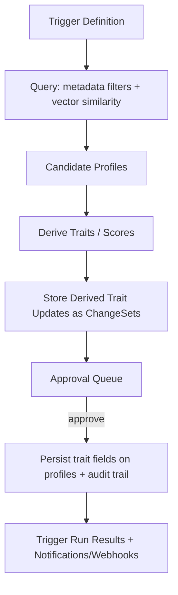

# AI-First Customer Intelligence Platform on .NET and Azure Cosmos DB

## Executive summary

An AI-first customer intelligence platform (CIP) can be implemented reliably on a Cosmos-first architecture: treat **all inbound signals** as append-only events, maintain a **materialized “customer profile” document** that is mostly metadata + an AI-generated profile card, and run **LLM agents** that propose controlled ChangeSets for humans to approve, merge, or reject. This fits Azure Cosmos DB’s strengths: schema-flexible documents, partition-local ACID transactions, optimistic concurrency with ETags, change feed for event-driven projections, and integrated vector indexing/search that can be combined with standard filters. citeturn2view1turn2view2turn10view4turn2view0

For an MVP, the **lowest operational complexity** path is: Cosmos DB (NoSQL) as system of record for profiles/events/ChangeSets/approvals/triggers, **Cosmos integrated vector search** for identity resolution and trigger targeting, and **Azure Blob Storage** only for oversized or compliance-sensitive artifacts (long Markdown, raw evidence payloads, attachments). This hybrid is also aligned with Cosmos’ practical constraints (2 MB item limit; avoid big items for cost/latency), and Azure Storage’s strengths for large unstructured objects with ETag-based concurrency and built-in encryption at rest. citeturn10view3turn14view1turn11search0turn11search24turn11search1

Key technical “non-negotiables” for correctness and compliance are: strict event idempotency, approval-gated merges/deletes, immutable audit trails, partitioning that supports both multitenancy and transactional writing, and explicit GDPR-friendly retention + deletion workflows (including understanding that **pseudonymized data remains personal data**). citeturn4search1turn4search2turn4search0turn4search8turn12search1

## Product thesis and operating model

The thesis is that a CIP should be an **operational substrate** for AI agents—not a UI-first CRM. Agents “operate” customer state by continuously ingesting signals, enriching profiles, deriving traits, recommending triggers/actions, and proposing merges or suppressions. Humans act as **approvers/monitors**: they validate data quality, confirm identity resolution, approve merges/deletes, and tune triggers/policies.

Under GDPR, a platform that “evaluates” individuals (e.g., propensity to convert, segmentation, ranking) can fall under **profiling** in the GDPR definition. Your operating model therefore should assume (a) explicit purpose limitation, (b) minimal stable identifiers, (c) strong auditability, and (d) the ability to honor data-subject rights such as deletion, plus storage limitation and integrity/confidentiality principles. citeturn4search1turn4search2turn4search0turn4search10turn2view3

A practical operational stance is:

- **Default “AI proposes, human approves.”**  
- **Every state change is traceable to evidence** (event IDs, sources, timestamps, confidence).  
- **Merges/deletes are approval-gated by default** (you can later allow “trusted automations” for low-risk updates, but that is post-MVP).  
- **Profiles evolve dynamically**, but the platform keeps a small core of stable metadata needed for deduplication, access control, governance, and indexing.

## Data model for AI-operated customer state

### Minimal stable metadata keys

You requested a minimal stable core. A pragmatic “must-have” set for indexing, deduplication, governance, and audit is:

- `tenant_id` (string): tenant boundary and primary isolation primitive (multitenancy designs in Cosmos commonly rely on a partition key per tenant for fully multitenant solutions). citeturn2view4turn12search1  
- `profile_id` (string): stable internal ID.  
- `created_at`, `updated_at` (timestamps): lifecycle.  
- `identities[]`: array of normalized identifiers with type + value + provenance (email, phone, external CRM ID, cookie/device IDs, etc.).  
- `merge_lineage`: a structure capturing merges/splits (source profiles, target profile, approval reference).  
- `traits[]`: derived or asserted traits with `value`, `confidence`, and `evidence[]` pointers.

These fields remain stable while the AI-generated sections (notes, summaries, narrative profile card) evolve.

### “Profile card” and unstructured AI sections

A “profile card” should be treated explicitly as:

- **AI-generated, non-authoritative narrative** (useful for humans and prompt conditioning), and  
- **bounded in size** (Cosmos items have a 2 MB maximum; Cosmos guidance also emphasizes keeping items small for optimal performance/cost). citeturn10view3turn14view1

Recommendation: store the profile card as **short Markdown** inside the profile document up to a safe cap (e.g., tens of KB), and move longform narrative history, raw evidence payloads, and attachments to Blob Storage when they risk item growth. Cosmos explicitly describes using Blob Storage for rich media and references back via metadata, and Blob is designed for massive unstructured objects. citeturn14view1turn11search0turn11search4

### ChangeSets as first-class records

To make AI operations auditable and approval-friendly, model **ChangeSets** as separate documents that contain:

- Proposed update operations (patch-style or replace-style),  
- Model/system prompt references used,  
- Evidence pointers,  
- A computed diff from current profile state, and  
- Approval status + approver identity + timestamp.

This is aligned with an event-sourced/projection mindset. Cosmos’ change feed is frequently used to support event sourcing and projection pipelines, and “event sourcing” is explicitly called out as a change feed use case. citeturn9search13turn2view2

## Storage and architecture on Azure Cosmos DB

### Cosmos DB feasibility for “AI-first CIP”

Cosmos DB supports schema-free JSON documents and is explicitly designed for horizontal scaling via partitioning. Logical partitions are the unit of distribution and transactional scope; each logical partition can store up to 20 GB, and physical partitions have their own throughput/storage caps. citeturn12search0turn17search6turn12search2

Cosmos also provides:

- **Optimistic concurrency control** via `_etag` with conditional updates (If-Match), supporting safe approvals where you must ensure the profile has not changed since the ChangeSet was proposed. citeturn2view1turn7search1turn19search22  
- **Transactional batch** operations with full ACID snapshot isolation *within the same logical partition key*, letting you atomically write “profile update + ChangeSet finalize + approval record” when they share a partition. citeturn10view4turn17search6  
- **Change feed** as a persistent record of changes, enabling asynchronous processors for projections (embeddings, trigger evaluations, dashboards). Change feed ordering is guaranteed per partition key (not across partition keys) and the change feed processor provides at-least-once processing with checkpointing. citeturn2view2turn7search3  
- **Point-in-time restore** under continuous backup, supporting operational recovery from accidental writes/deletes (and continuous backups are taken in the background without consuming extra provisioned throughput). citeturn10view1turn9search2

### Partitioning and multi-tenant isolation choices

A Cosmos partition key is the most consequential early decision. Cosmos guidance highlights: each logical partition is up to 20 GB; per physical partition throughput is capped; and transactions are scoped to a logical partition (partition key). citeturn12search0turn17search6turn10view4

**Option A: Partition key = `tenant_id` (single-level)**  
This is the simplest for multitenant isolation, and is explicitly recommended as a common pattern for fully multitenant solutions. citeturn2view4turn12search1  
Trade-off: a single tenant’s heaviest profiles/events may concentrate into one logical partition value if the container stores many doc types per tenant. Large tenants can hit the 20 GB logical partition limit and the 10,000 RU/s per logical partition behavior implied by physical partition mapping. citeturn12search0turn12search2

**Option B: Hierarchical partition keys for tenant scaling**  
Cosmos supports hierarchical partition keys (up to three levels) to improve scaling and allow large tenants to exceed the 20 GB limit for “tenant prefix” scenarios (by distributing across subpartitions). This is specifically recommended for large tenants in Cosmos multitenancy guidance. citeturn12search1turn12search3turn17search3  
Design fit for CIP: `tenant_id -> profile_shard -> profile_id` (or `tenant_id -> profile_id -> doc_type`), depending on your query patterns and transactional needs. Since transactional batch scope is “within the same logical partition key” and hierarchical partitioning defines the logical partition as the full path, you should plan atomic writes around that full path (inference from “logical partition defines transaction scope” + “logical partition is full partition key path” in hierarchical mode). citeturn17search6turn17search3turn10view4

**Option C: Account-per-tenant (strong isolation)**  
Cosmos multitenancy guidance notes “database account per tenant” as a model often used for B2B SaaS solutions. This yields the strongest hard isolation but increases operational overhead and client management complexity. citeturn2view4turn1search33

### Container design for an AI-operated CIP

A Cosmos design that stays “minimal but scalable” typically separates:

- **Events container** (append-only): every webhook call becomes one event document.  
- **Profiles container** (materialized state): one profile document per customer.  
- **ChangeSets container**: proposals and diffs, linked to events.  
- **Approvals container**: statuses and reviewer actions (or embed into ChangeSet).  
- **Triggers container**: trigger definitions plus per-run results.

This reduces “hot document” updates and helps with RU predictability. RU costs for reads/writes/queries vary by operation complexity; Cosmos normalizes this with Request Units, with different provisioning modes (provisioned, serverless, autoscale). citeturn2view5turn6search0

### Consistency, concurrency, and correctness

**Optimistic concurrency for approvals**  
Use profile `_etag` captured when a ChangeSet was generated; commit the ChangeSet only if the stored `_etag` matches (If-Match). This prevents “approve stale diff” issues. Cosmos explicitly documents `_etag` and If-Match OCC behavior. citeturn2view1turn7search1

**Transactions for multi-document commits**  
When you need atomic commits across multiple documents, use transactional batch—but only when all documents share the same partition key value (logical partition). Cosmos documents full ACID snapshot-isolated transactions within a partition key for transactional batch. citeturn10view4turn7search6

**Idempotency for event ingestion**  
Cosmos states each item has a partition key and an item ID unique within that partition; the combination uniquely identifies the item. This means you can use `(tenant_id, event_id)` as your natural idempotency key: `id = event_id`, partition key = `tenant_id`, and `CreateItem` becomes “insert once.” citeturn16search6turn17search6  
If you need uniqueness guarantees beyond `id`, Cosmos supports unique key constraints within a logical partition. citeturn16search0

### Backup/restore and replay

Cosmos supports continuous backup with **point-in-time restore** within the retention period and can restore deleted accounts/databases/containers, with backups taken in the background without extra RU consumption. citeturn10view1turn9search2  
For replay/rebuild semantics, you have two layers:

1. **Event-sourced rebuild**: reprocess events (if retained) to reconstruct profiles and derived traits; change feed design patterns explicitly describe event sourcing with the change feed and replay from the beginning. citeturn9search13turn2view2  
2. **Operational restore**: use point-in-time restore for disaster recovery / accidental corruption “as it was.” citeturn10view1

If you require an immutable “full-fidelity history including deletes,” Cosmos provides an “all versions and deletes” change feed mode (preview) that requires continuous backups. citeturn9search2turn2view2

## Vector search and identity resolution on Cosmos

### Cosmos integrated vector search

Cosmos supports native vector indexing/search with vectors stored alongside documents, and vector search can be combined with standard query filters and indexes using `WHERE` clauses (enabling “hybrid” constraints like tenant scoping + vector similarity). citeturn2view0turn13search3

Cosmos vector search has operational constraints that affect MVP planning:

- `flat` index is brute-force and limited to 505 dimensions; `quantizedFlat` and `DiskANN` support higher dimensions (up to 4,096) but require enough vectors to build accurate quantization and may fall back to full scan below 1,000 vectors. citeturn18search0turn18search3  
- Vector indexing/search has enablement constraints (for example, once enabled per container it may not be disableable in-place; also certain throughput configurations have limitations per docs). citeturn8search3

### Embedding strategies for CIP profiles

For identity resolution and trigger targeting, a single embedding per profile is often insufficient. A balanced approach:

- **Profile synopsis vector**: embed a curated “synopsis string” derived from authoritative fields + top traits (stable and small; cheap to update).  
- **Evidence chunk vectors** (optional): embed notes, conversations, web events, or external docs as smaller chunks, with each chunk linked to a profile and evidence source.  
- **Multi-vector per profile**: keep separate vectors for “company fit,” “intent,” “recency,” etc., if you want targeted similarity spaces (post-MVP).

Vector search products differ in consistency and hybrid search support. For example:
- entity["organization","Milvus","open-source vector database"] supports metadata filtering prior to ANN search and offers multiple tunable consistency levels. citeturn5search0turn5search1  
- entity["company","Pinecone","vector database company"] is eventually consistent (there can be a delay before new/changed records are visible). citeturn5search2turn5search30  
- entity["company","Weaviate","vector database company"] supports hybrid search that fuses BM25-based keyword search with vector search. citeturn5search3turn5search7  
- entity["organization","pgvector","postgresql vector extension"] supports ANN indexes like HNSW and IVFFlat, with HNSW typically offering a better speed–recall tradeoff than IVFFlat at the cost of memory and build time. citeturn13search0turn13search7  

For an MVP on Cosmos DB NoSQL, integrated vector search is usually the simplest because it avoids cross-system synchronization and supports metadata-constrained vector queries in the same engine. citeturn2view0turn13search3

### Similarity thresholds and hybrid search

Similarity thresholds are application-specific and **must be calibrated empirically** (unspecified: your customer domains, identifier types, and acceptable false-merge risk). The platform should support:

- **Two-threshold policy** for identity resolution:  
  - “Auto-suggest” threshold (lower; produces candidates)  
  - “Safe merge suggestion” threshold (higher; still requires approval)  
- **Hybrid constraints**: always constrain by `tenant_id`, and optionally by identity type domain (email domain, region, etc.) using structured filters. Cosmos vector search supports combining vector search with `WHERE` filters. citeturn2view0turn13search3

### Reindexing and embedding caching

Reindexing strategies differ by store:

- In Cosmos integrated vector: treat embeddings as document properties; updating embeddings is a normal write. Index build behavior depends on index type and ingestion rate; large ingestion bursts can require more index build time. citeturn8search3turn18search4  
- External vector DBs: you manage ingestion pipelines and must handle eventual consistency issues (explicit in Pinecone). citeturn5search2turn5search30

For caching: store `(content_hash, embedding_vector, model_id, created_at)` as a separate “embedding cache” store keyed by hash to avoid recomputation when the same synopsis/chunk repeats (implementation detail; no primary-source requirement).

## Event ingestion, approvals, triggers, and audit

### Single webhook to event envelope

A single webhook should accept a normalized envelope:

- `event_id` (caller-provided or server-generated),  
- `tenant_id`,  
- `source`, `event_type`,  
- `occurred_at`, `received_at`,  
- `subject` (raw identifiers / lead info),  
- `payload` (raw content or pointer),  
- `schema_version`,  
- `signature` / auth metadata.

**Idempotency**: write the event once using `(tenant_id, event_id)` as your unique identity. Cosmos item ID is unique within a partition key, so duplicate inserts collide naturally. citeturn16search6turn17search6

### Optimistic concurrency and locking

For profile updates and approval commits:

- Use `_etag` with If-Match. Cosmos documents `_etag` for OCC. citeturn2view1turn7search1  
- When a conditional fails, treat it as a concurrency conflict (HTTP 412 “Precondition Failed” is the standard semantics for conditional request failure; Cosmos OCC docs also describe rejecting when If-Match is no longer current). citeturn19search0turn19search2turn19search22

If you use Blob as a hybrid store for Markdown/evidence, Blob also supports ETag-based concurrency control: update with If-Match and get HTTP 412 if the blob was updated by another process. citeturn11search24turn19search6turn19search3

### Approval-gated merges/deletes

A merge flow should be modeled as:

- Agent proposes merge → creates a MergeChangeSet referencing candidate profiles and evidence.  
- Human approves → commit uses If-Match on both profiles’ `_etag` to ensure neither changed.  
- Commit writes `merge_lineage` and produces either:
  - a “survivor profile” updated + “tombstone profile” marked merged, or  
  - a new profile with lineage and both inputs tombstoned.

Because transactional batch is partition-scoped, if the two profiles are in different logical partitions, the merge commit cannot be fully ACID in one batch; you must either design partitioning to co-locate merge candidates (rare) or implement a **saga-style** commit with careful idempotency and compensations (design recommendation). citeturn10view4turn17search6

### Trigger schema and mapping to customer metadata

Treat triggers as:

- **Definitions**: declarative conditions over metadata + derived traits.  
- **Runs**: an evaluated result set (candidates) with scoring and evidence.  
- **Actions**: optional downstream webhooks or tasks.

Store derived traits in profiles (e.g., `traits[]`) but preserve a history/audit trail via ChangeSets or trait-history documents. Since change feed ordering is guaranteed per partition key (not across partitions), you should design trigger runs to be partition-local when possible and tolerate eventual consistency between partitions. citeturn2view2turn17search6

### Mermaid diagram: event flow

```mermaid
flowchart LR
  A[Single Webhook Endpoint] --> B[Events Container (append-only)]
  B --> C[Identity Resolution (vector + metadata filters)]
  C --> D[Agent Enrichment Worker]
  D --> E[Proposed ChangeSet Document]
  E --> F[Approval UI (diff / evidence)]
  F -->|approve| G[Commit Writer (ETag If-Match)]
  F -->|reject| H[ChangeSet Closed]
  G --> I[Profiles Container (materialized state)]
  I --> J[Change Feed]
  J --> K[Derived Projections: embeddings / trigger indexes / dashboards]
```

(ETag/OCC and change feed behavior are documented in Cosmos docs; use them as the correctness backbone for approvals and projections.) citeturn2view1turn2view2turn7search3

### Mermaid diagram: trigger-to-profile mapping



(Vector search + `WHERE` filtering in Cosmos supports the “metadata + vector” evaluation path; approval gating keeps derived traits from silently becoming authoritative.) citeturn2view0turn13search3turn2view1

## Security, compliance, and operational costs

### Security controls in Azure

Cosmos DB security guidance emphasizes: restrict network access (private endpoints / disable public access), use managed identities, use control-plane and data-plane RBAC, and encryption at rest/in transit (with optional customer-managed keys). citeturn2view3turn6search3turn6search14  
If you enable customer-managed keys, Cosmos requires that keys live in entity["organization","Azure Key Vault","cloud key management service"], and the key encrypts all data in the account (with specific metadata exceptions listed in the docs). citeturn10view2turn6search14  

Key Vault is for secrets and keys, not for storing general customer content; Microsoft explicitly notes Key Vault is “not a data store” and customer content (excluding secrets/certs) should not be stored there. citeturn3search0turn3search1

### GDPR implications

From a data-protection standpoint, core considerations include:

- **Personal data definition** is broad, and “profiling” is explicitly defined as automated processing to evaluate or predict personal aspects. citeturn4search1turn4search21  
- **Principles** include storage limitation and integrity/confidentiality, driving retention/deletion policies and security controls. citeturn4search2turn4search10  
- **Right to erasure** (Article 17) requires designing deletion workflows that propagate through profiles, merges, and derived indexes. citeturn4search0turn4search11  
- **Pseudonymized data remains personal data** when re-linkage is possible; the entity["organization","European Data Protection Board","eu data protection body"] explicitly emphasizes this point. citeturn4search8turn4search12

### Operational costs

Cost drivers in Cosmos DB are dominated by:

- Throughput provisioning model and RU consumption; Cosmos normalizes database operations into Request Units and supports provisioned, serverless, and autoscale modes. citeturn2view5turn6search0  
- Storage and indexing overhead (indexes can add overhead; Cosmos provides tuning via indexing policy). citeturn14view1turn9search0  
- Multi-region replication multiplies RU and storage costs across regions. citeturn2view5turn14view1

Hybrid storage reduces RU pressure when you offload large, infrequently queried payloads to entity["organization","Azure Blob Storage","object storage service"] (designed for unstructured data and automatically encrypted at rest). citeturn11search0turn11search1turn14view1

## Implementation patterns in C# .NET 10 and React/Vite/Tailwind

### .NET runtime support note

Microsoft’s policy distinguishes STS vs LTS releases; LTS releases receive three years of free support and patches, and releases are annual. Confirm the exact LTS/EOL dates for your chosen .NET baseline during implementation. citeturn7search0turn7search32

### Cosmos DB operations in C#

Core patterns (supported directly by Cosmos .NET SDK docs):

- **Conditional update via IfMatchEtag** (`RequestOptions.IfMatchEtag`) for approval commits. citeturn7search1turn2view1  
- **TransactionalBatch** for partition-local atomic commits. citeturn7search2turn10view4  
- **Change feed processor** for asynchronous pipelines (embeddings, trigger evaluation). citeturn7search3turn2view2  
- **Partial document update (Patch API)** to avoid replacing large documents; patch supports conditional predicates and is more bandwidth-efficient than full replace. citeturn16search5turn16search1

### Embedding calls and safe key storage

For “bring your own model keys,” store third-party API keys in Key Vault (not in Cosmos, not in source control). Key Vault security guidance explicitly discourages storing “customer content” there and positions it for secrets/keys, using RBAC and managed identities. citeturn3search0turn3search1turn3search16

Where possible, prefer passwordless authentication to Azure resources using managed identity (Cosmos docs and samples emphasize Entra ID / DefaultAzureCredential patterns). citeturn6search3turn18search2

### Frontend considerations for diff and approvals

Given your “four pages” concept, a React/Vite/Tailwind UI typically needs:

- **Approval queue** that displays ChangeSets ordered by risk (merge/delete highest).  
- **Diff UI** highlighting JSON patch or field-level diffs, plus evidence links.  
- **“View current profile” vs “proposed profile”** side-by-side.  
- **Conflict handling**: if approval commit hits ETag mismatch (precondition failure), the UI should prompt to regenerate the ChangeSet against the latest profile and re-approve (ETag/If-Match is the core mechanism). citeturn2view1turn19search2turn7search1

## Architecture options and recommendation

### Trade-off table for Cosmos-based choices

| Architecture choice | Performance & scalability | Consistency & concurrency | Backup/restore & audit | Security & compliance | Complexity & dev ergonomics | Recommended use |
|---|---|---|---|---|---|---|
| Cosmos-only (NoSQL + integrated vector) | Strong operational simplicity; scaling via partitions; vector+filters in one query engine | OCC via `_etag`; transactional batch per partition key | Change feed + PITR; full-fidelity deletes require special mode | RBAC + encryption at rest; CMK via Key Vault | Lowest moving parts | MVP default when profile artifacts stay under item-size limits |
| Cosmos + Blob for artifacts | Offloads large content; cheaper for big payloads | Blob supports ETag If-Match for safe updates | Blob versioning/immutability possible; Cosmos keeps indexes | Clear separation of PII-heavy artifacts; encryption at rest in Storage | Moderate; 2 services | Recommended if you store Markdown/history/evidence blobs |
| Cosmos + external vector DB | Potentially best-of-breed vector scale/tuning | Cross-system sync; eventual consistency risk depends on vector DB | Two backup domains | More vendors, more DPIA surface | Higher complexity | Post-MVP only if Cosmos vector constraints become limiting |

(Cosmos transactional scope, ETag-based OCC, item size limits, and vector filter support are the core reasons the “Cosmos-only or Cosmos+Blob” options are usually the best fit for an AI-operated CRM replacement.) citeturn10view4turn2view1turn10view3turn13search3turn14view1

### Recommended MVP architecture on Cosmos DB

**Recommendation:** Cosmos NoSQL as canonical store + integrated vector search + Blob for long artifacts.

- Use Cosmos for: events, profiles, ChangeSets, approvals, triggers, derived traits, embeddings (synopsis vectors). citeturn2view0turn2view2turn10view4  
- Use Blob for: long Markdown profile histories, raw evidence payloads, media/attachments, large snapshots; reference them from Cosmos by URI and metadata. citeturn14view1turn11search0turn11search24  
- Partition with multitenancy in mind: start with `tenant_id`-first strategies and consider hierarchical partition keys for large tenants. citeturn2view4turn12search1turn12search3  
- Use change feed processor to keep derived indexes and dashboards fresh, accepting at-least-once semantics and designing idempotent consumers. citeturn2view2turn7search3turn9search13

### MVP milestones and success metrics

**Milestones (MVP)**  
- Webhook ingestion + Events container with idempotency and schema versioning. citeturn16search6turn17search6  
- Profile materializer (events → profile doc) with OCC/ETag updates and patch-based modifications. citeturn2view1turn16search5  
- Identity resolution v1: vector search on “synopsis vectors” + strict tenant filters + approval-gated merges. citeturn2view0turn13search3turn4search0turn4search1  
- ChangeSet + approval UI with robust diff view and conflict handling. citeturn2view1turn19search2  
- Trigger engine v1: define triggers, run evaluations, store results, allow “manual run” and “scheduled run” (scheduling mechanism unspecified).  
- Backup/recovery runbook: continuous backup + a tested restore scenario. citeturn10view1turn9search2  

**Success metrics (MVP)**  
- Identity resolution precision/recall measured on labeled merge decisions (target thresholds unspecified; must be calibrated).  
- Time-to-approve: median seconds/minutes per ChangeSet in the approval UI.  
- “Silent error” rate: number of rejected/rolled-back changes due to missing evidence or concurrency conflicts (should trend down).  
- RU cost per 1,000 events ingested and per 1,000 profiles evaluated (baseline and weighted by tenant/activity). citeturn2view5turn6search0  
- GDPR operational readiness: ability to locate and erase profile data + derived embeddings and artifacts; ability to justify retention policies (principles and erasure rights are explicit in GDPR). citeturn4search2turn4search0turn4search8  

**Post-MVP roadmap (prioritized)**  
- Hierarchical partition keys migration path if tenant skew emerges (note: hierarchical keys must be planned early; adding later requires new containers and migration). citeturn17search3turn12search1  
- “All versions and deletes” change feed mode for high-fidelity audit (preview; requires continuous backups). citeturn9search2turn2view2  
- Policy-driven data minimization, TTL-based retention, and archival to Blob/other stores (Cosmos describes TTL and migration patterns). citeturn14view1turn4search2  
- Advanced trigger builder (human-friendly DSL), experimentation (A/B prompts), and model governance (model registry, drift monitoring) (unspecified details).