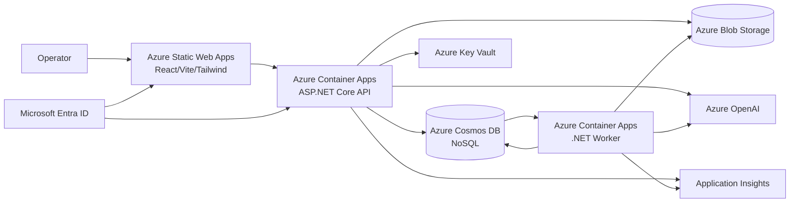
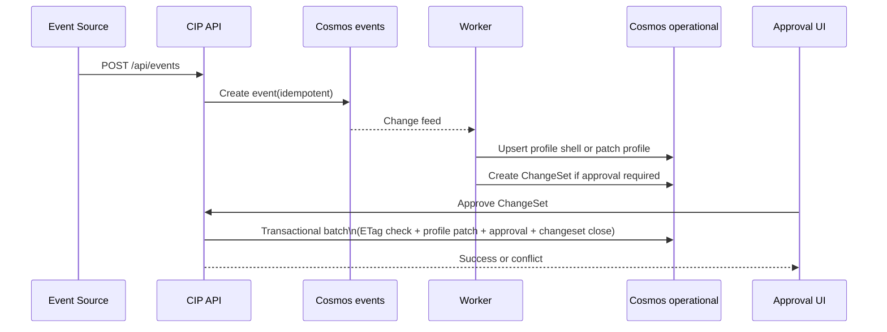

# Azure-First MVP Architecture for Customer Intelligence Platform

## Business context

This document turns the product brief in `CIP product.md` into a concrete Azure-first MVP architecture and phased implementation strategy for a greenfield Customer Intelligence Platform (CIP).

The MVP goal is to start building immediately with the fastest viable path that still preserves the product's core operating model:

- append-only event ingestion
- materialized customer profiles
- AI-proposed, human-approved ChangeSets
- vector-assisted identity resolution and targeting
- Azure-native deployment with a clear evolution path

## Goals

- Deliver an MVP on Azure using conventional, low-friction services.
- Keep Cosmos DB NoSQL as the canonical operational store.
- Support approval-gated updates, merges, and deletes.
- Enable event-driven profile materialization and async enrichment.
- Provide a React/Vite/Tailwind web app and .NET backend.
- Keep the design simple enough for a small team to implement now.

## Non-goals

- Microservice decomposition from day one.
- Multi-region active-active deployment.
- External vector database for MVP.
- Fully automated profile mutation without human approvals.
- Enterprise MDM, complex workflow engines, or broad marketplace integrations.

## Current-state repo context

### Confirmed repo facts

- Workspace is greenfield.
- The only file present is `D:\_WS\CIP\CIP product.md`.
- No git repository is initialized.
- No existing application code, IaC, CI/CD, or test projects exist yet.

### Confirmed product-direction facts from the brief

- Azure is the target cloud.
- Cosmos DB NoSQL is the intended canonical store.
- Integrated vector search is preferred for MVP.
- Blob Storage should hold oversized artifacts.
- Approval-gated ChangeSets are required.
- Event ingestion, profile materialization, and trigger evaluation are required.
- Frontend target is React/Vite/Tailwind.
- Backend target is .NET.

## Assumptions

- MVP users are internal operators/approvers, not public self-service end users.
- Initial tenant and event volume are moderate enough for a `/tenantId` partitioning strategy.
- One Azure region is acceptable for MVP production.
- Azure AI is available in the chosen region or a paired approved region; runtime may still use an Azure OpenAI resource.
- Approval-gated changes are required for material profile mutations; low-risk auto-apply is post-MVP.
- Initial trigger execution can tolerate near-real-time/eventual consistency rather than strict global ordering.

## Decisions needed

These do not block the architecture artifact, but they materially affect implementation details.

| Decision | Options | What changes | Recommended default |
|---|---|---|---|
| User auth model | Internal workforce only vs external tenant users | Identity provider setup, tenant mapping, invitation model, UI auth flow | Internal workforce only with Microsoft Entra ID |
| Tenant scale expectation | Small/medium vs very large tenants early | Partition key choice, container migration timing, cost model | Start with `/tenantId`; migrate to hierarchical keys only if scale evidence appears |
| Data residency | Single region vs strict geo residency | Azure region topology, backup/restore plan, legal review | Single-region MVP |
| Trigger execution style | Manual + scheduled vs fully event-driven realtime | Worker design, queueing, operator UX | Manual + scheduled, plus event-driven recalculation where cheap |
| Model provider boundary | Azure AI only vs bring-your-own model keys | Secret storage, abstraction depth, compliance posture | Azure AI first, with runtime support for Azure OpenAI resources at the infrastructure layer |

## Recommended architecture

### Summary

Use a **modular monolith** implemented as:

- **React/Vite/Tailwind SPA** hosted on **Azure Static Web Apps**
- **ASP.NET Core Web API (.NET 10)** on **Azure Container Apps**
- **.NET Worker Service** on **Azure Container Apps** for change feed processing, enrichment, and scheduled triggers
- **Azure Cosmos DB NoSQL** as the canonical store
- **Cosmos integrated vector search** for identity suggestions and profile targeting
- **Azure Blob Storage** for large evidence/artifacts
- **Azure AI** for embeddings and profile-card generation, with Azure OpenAI resources still valid at runtime
- **Microsoft Entra ID** for operator authentication
- **Azure Key Vault** for secrets/config references
- **Application Insights + Log Analytics** for observability

This is the best MVP default because it preserves the product thesis while minimizing moving parts and keeping a clean path to later scale-out.

### Why this option was chosen

1. **Fastest viable delivery**: one frontend, one API, one worker, one primary database pattern.
2. **Matches the product brief directly**: Cosmos + vector + Blob + approval gating.
3. **Avoids premature distributed complexity**: no microservices, no separate queue fabric unless needed.
4. **Strong evolution path**: workers can split later, Service Bus can be added later, partition strategy can evolve later.

## Domain boundaries

Implement the backend as a modular monolith with clear boundaries:

1. **Ingestion**
   - accepts normalized event envelopes
   - enforces idempotency
   - stores append-only events

2. **Profiles**
   - materializes customer state
   - stores stable metadata, traits, profile card, vector fields, merge lineage

3. **Identity Resolution**
   - generates synopsis strings
   - computes embeddings
   - suggests candidate matches using vector + metadata filters

4. **Change Governance**
   - produces ChangeSets
   - diff generation
   - approval/rejection workflow
   - optimistic concurrency checks

5. **Triggers**
   - trigger definitions
   - scheduled/manual execution
   - result storage and action dispatch hooks

6. **Artifacts & Evidence**
   - Blob-backed large payloads
   - URI/metadata references from Cosmos documents

7. **Platform/Admin**
   - tenant config
   - retention policies
   - operator roles and audit views

## Data architecture

### MVP storage layout

Use the following Cosmos containers:

| Container | Partition key | Purpose | Notes |
|---|---|---|---|
| `events` | `/tenantId` | append-only inbound events | idempotent insert using `id = eventId` |
| `operational` | `/tenantId` | profiles, changesets, approvals, triggers, runs, tenant config | original MVP single-container shape |
| `leases` | `/id` | change feed leases | worker-owned |

Use Blob containers:

- `artifacts-raw` for raw evidence payloads/attachments
- `artifacts-rendered` for long markdown/history exports

Current source-controlled target for step 1 rollout is a separate `operational-vectors` container: a DiskANN-ready Cosmos container with vector search capability enabled for profile synopsis vectors. That keeps the legacy `operational` container unchanged in already-deployed environments until they are migrated or redeployed.

### Why a single `operational` container is recommended for MVP

The product brief emphasizes approval-gated commits and partition-local atomicity. Cosmos transactional batch is scoped to a single container and logical partition. Using one `operational` container with `docType` enables atomic updates such as:

- profile update + changeset finalization
- approval record + profile mutation
- merge lineage update + source profile tombstone

This is simpler and safer than splitting profiles and ChangeSets across separate containers in MVP.

### Document types in `operational`

| `docType` | Key fields |
|---|---|
| `profile` | `id`, `tenantId`, `profileId`, `identities[]`, `traits[]`, `profileCard`, `synopsis`, `synopsisVector`, `mergeLineage`, `_etag` |
| `changeset` | `id`, `tenantId`, `targetProfileId`, `type`, `baseProfileEtag`, `proposedOps`, `diff`, `evidenceRefs[]`, `status`, `proposedBy` |
| `approval` | `id`, `tenantId`, `changesetId`, `decision`, `decidedBy`, `decidedAt`, `reason` |
| `trigger-definition` | `id`, `tenantId`, `name`, `status`, `criteria`, `schedule`, `actionConfig` |
| `trigger-run` | `id`, `tenantId`, `triggerId`, `startedAt`, `completedAt`, `status`, `matchCount`, `resultRefs[]` |
| `tenant-config` | `id`, `tenantId`, `retentionPolicy`, `allowedSources`, `featureFlags` |

### Event document shape

```json
{
  "id": "evt_01J...",
  "tenantId": "tenant_123",
  "eventType": "lead.created",
  "source": "hubspot",
  "occurredAt": "2026-03-31T10:15:00Z",
  "receivedAt": "2026-03-31T10:15:03Z",
  "subject": {
    "email": "person@example.com",
    "crmId": "12345"
  },
  "payloadRef": {
    "kind": "inline",
    "blobUri": null
  },
  "schemaVersion": 1,
  "ingestSignature": "...",
  "processingState": "pending"
}
```

### Partitioning recommendation

**MVP default: partition by `/tenantId` for both `events` and `operational`.**

Reasoning:

- simplest multitenant boundary
- easiest query pattern for tenant-scoped UI and APIs
- easiest transactional batch model for approvals and merges within a tenant
- fastest implementation path

Tradeoff:

- large tenants can become hot or exceed logical partition growth targets

Migration trigger:

- if a tenant approaches sustained hot-partition pressure or storage limits, move to hierarchical keys in a v2 container strategy

## Application architecture

### Backend hosting model

- **`cip-api`**: ASP.NET Core Web API on Azure Container Apps
- **`cip-worker`**: .NET Worker Service on Azure Container Apps

The worker handles:

- change feed processing on `events`
- profile materialization
- embedding generation
- AI summarization/profile-card refresh
- ChangeSet proposal generation
- scheduled trigger evaluation

Keep these in one worker deployment initially, separated internally by hosted services and modules.

### API surface

| Area | Endpoint | Purpose |
|---|---|---|
| Ingestion | `POST /api/events` | ingest normalized event envelope with idempotency key |
| Profiles | `GET /api/profiles` | tenant-scoped list/search |
| Profiles | `GET /api/profiles/{profileId}` | profile detail |
| Profiles | `POST /api/profiles/search` | filter + vector-assisted search |
| ChangeSets | `GET /api/changesets` | approval queue |
| ChangeSets | `GET /api/changesets/{id}` | diff/evidence/detail |
| ChangeSets | `POST /api/changesets/{id}/approve` | commit proposed mutation with ETag check |
| ChangeSets | `POST /api/changesets/{id}/reject` | close proposal with reason |
| Triggers | `GET /api/triggers` | list definitions |
| Triggers | `POST /api/triggers` | create/update definition |
| Triggers | `POST /api/triggers/{id}/run` | manual run |
| Artifacts | `POST /api/artifacts/upload-url` | issue SAS/upload flow for large payloads |
| Admin | `GET /api/tenants/{tenantId}/settings` | tenant config |

### Background processing model

#### Event path

1. API validates and writes event to `events`.
2. Change feed processor picks up new event.
3. Worker resolves profile candidate or creates a new profile shell.
4. Worker patches the profile and/or emits a ChangeSet if mutation requires approval.
5. Worker refreshes synopsis and embedding if profile changed materially.
6. Worker optionally schedules trigger reevaluation.

#### Approval path

1. Operator opens ChangeSet in UI.
2. API loads ChangeSet + current profile.
3. On approve, API verifies `baseProfileEtag`.
4. API executes transactional batch in `operational` for profile patch + ChangeSet status + approval record.
5. If ETag mismatch occurs, API returns conflict/precondition failure and the UI prompts regenerate-and-review.

### Auth approach

**Recommended MVP auth: Microsoft Entra ID for internal operators.**

- SPA uses MSAL.
- API validates bearer tokens from Entra ID.
- App roles/scopes:
  - `cip.reader`
  - `cip.operator`
  - `cip.approver`
  - `cip.admin`
- Tenant membership is enforced in application logic using tenant claims or an internal operator-to-tenant mapping document.

If external customer logins are later required, introduce Entra External ID without redesigning the backend domain model.

## Azure deployment architecture

### Azure services

| Concern | Azure service | MVP rationale |
|---|---|---|
| SPA hosting | Azure Static Web Apps | fastest static hosting and simple CI/CD |
| API hosting | Azure Container Apps | simple managed container hosting for .NET API |
| Worker hosting | Azure Container Apps | supports long-running change feed workers |
| Canonical store | Azure Cosmos DB for NoSQL | required by product direction |
| Vector search | Cosmos integrated vector search | avoids cross-store sync |
| Large artifacts | Azure Blob Storage | lower cost and better fit for large unstructured payloads |
| AI models | Azure AI | Azure-native embeddings and generation; may use Azure OpenAI resources |
| Secrets/keys | Azure Key Vault | managed secret storage |
| Monitoring | Application Insights + Log Analytics | standard Azure observability |
| Identity | Microsoft Entra ID | conventional operator auth |

### Environment strategy

- **Local**: run web/api/worker locally against shared Azure Dev resources; avoid emulator drift for vector search/change feed.
- **Dev**: shared integration environment for daily development.
- **Staging**: production-like validation, smoke/perf/UAT.
- **Prod**: isolated environment with separate Cosmos account and storage account.

Recommended isolation:

- separate resource groups per environment minimum
- separate Cosmos accounts per environment
- separate Storage accounts per environment
- separate Entra app registrations for non-prod and prod if operationally feasible

### Mermaid: high-level deployment architecture



### Mermaid: key ingestion-to-approval flow



## Alternative options and tradeoffs

### Option 1 - Recommended: modular monolith on Container Apps

**Pros**

- lowest cognitive load
- long-running workers fit well
- clean split between sync API and async processing
- easy to evolve into more services later

**Cons**

- less fine-grained scaling than fully decomposed services

### Option 2 - Azure Functions-first

Use Functions for HTTP ingestion, change feed, and timers.

**Pros**

- very low platform management
- good fit for event-driven tasks

**Cons**

- approval and long-running orchestration become harder to structure cleanly
- local development and cross-cutting composition can get fragmented
- worker logic tends to sprawl sooner

### Option 3 - Queue-centric microservices with Service Bus

Use API + multiple services + Service Bus for all async handoffs.

**Pros**

- strongest workload isolation
- best scale independence

**Cons**

- too much operational and delivery overhead for MVP
- duplicates value already provided by Cosmos change feed for core projections

## Solution and module layout

Recommended repo structure once implementation starts:

```text
/docs
  /architecture
    azure-first-mvp.md
/infra
  /bicep
    main.bicep
    /modules
/src
  /backend
    /Cip.Api
    /Cip.Worker
    /Cip.Application
    /Cip.Domain
    /Cip.Infrastructure
    /Cip.Contracts
  /web
    /cip-web
/tests
  /Cip.UnitTests
  /Cip.IntegrationTests
  /Cip.ApiTests
  /cip-web-e2e
```

Implementation style recommendation:

- backend as **modular monolith with vertical slices per domain boundary**
- keep shared abstractions small
- put Cosmos/Blob/Azure AI implementations in `Infrastructure`
- keep API DTOs/contracts isolated from domain objects

## Implementation strategy and phases

### Phase 0 - Foundation

Dependencies: none

- initialize git repo and monorepo structure
- create Azure resource naming/environment conventions
- stand up baseline Bicep for dev environment
- provision Cosmos, Storage, Key Vault, App Insights, Container Apps environment, Static Web Apps
- set up Entra app registrations
- create basic CI/CD pipeline skeleton

### Phase 1 - Event ingestion and profile shell

Dependencies: Phase 0

- implement `POST /api/events`
- enforce event idempotency with `id = eventId`
- create `events` and `operational` container contracts
- implement change feed worker
- create profile shell creation/materialization rules
- add basic profile list/detail UI
- add audit logging/telemetry around ingest throughput and failures

**Outcome**: platform can ingest events and materialize customer profiles.

### Phase 2 - ChangeSets and approvals

Dependencies: Phase 1

- implement ChangeSet creation model and diff generation
- build approval queue UI and ChangeSet detail view
- implement approve/reject endpoints
- add ETag-based concurrency handling
- implement transactional batch commit path in `operational`
- support merge proposal and tombstone lineage model

**Outcome**: human-governed profile mutation path is live.

### Phase 3 - Embeddings and identity resolution v1

Dependencies: Phase 1, Phase 2 for approval workflow

- generate synopsis text from stable profile fields
- call Azure AI embeddings
- persist `synopsisVector` on profile docs
- implement vector-assisted candidate search with tenant filters
- create merge suggestion ChangeSets from candidate threshold logic
- expose operator review UX for identity suggestions

**Outcome**: vector-assisted identity resolution is working with human approval.

Status note: this phase is source-complete in code and rollout-pending for existing environments. The current source-controlled target stores profile synopsis vectors on profile documents, supports live Azure AI embeddings with deterministic fallback, exposes `POST /api/profiles/search`, and targets the DiskANN-ready `operational-vectors` container with Cosmos vector search capability. Remaining rollout work for existing environments is operational: migrate or redeploy to the new container shape, re-embed existing profiles into that container, and then enable the native runtime path there. Evidence chunk embeddings and merge suggestion workflows still remain follow-on work.

### Phase 4 - Trigger engine v1

Dependencies: Phase 1

- define trigger definition schema
- support manual run and simple scheduled run
- evaluate triggers against profile metadata/traits/vector-assisted queries where needed
- persist trigger runs/results
- add operator UI for trigger definitions and recent runs

**Outcome**: platform can target and evaluate customer segments/actions.

### Phase 5 - Hardening and operational readiness

Dependencies: prior phases

- retention/deletion workflows
- restore/replay runbook
- access review and role hardening
- performance tuning and indexing policy refinement
- production dashboards/alerts
- staging validation and go-live checklist

## Prioritized dependency view

1. Foundation and IaC
2. Ingestion API
3. Change feed worker
4. Profile materialization
5. Approval workflow
6. Embeddings/vector search
7. Trigger engine
8. Retention/compliance hardening

## Recommended first execution slice to build immediately

Build **"Event ingestion to profile shell"** first.

Scope:

- create repo skeleton
- provision dev Azure resources
- implement Entra-authenticated SPA + API skeleton
- implement `POST /api/events`
- write idempotent events to Cosmos
- run worker from change feed
- create/update a minimal `profile` document
- show profile list/detail in the UI
- capture telemetry for event ingestion and worker processing

Why this slice first:

- validates the canonical storage pattern
- validates change feed processing model
- proves multitenant document design
- gives a working end-to-end vertical slice quickly
- creates the foundation required for approvals, vectors, and triggers

## Risks, dependencies, and open questions

### Top risks

1. **Partition hot-spot risk**
   - `/tenantId` is best for MVP simplicity but may not fit very large tenants forever.

2. **Approval workflow complexity**
   - poorly modeled ChangeSets can slow operator throughput; diff UX matters.

3. **Identity resolution false positives**
   - vector similarity must remain suggestion-only in MVP.

4. **Artifact growth in Cosmos**
   - profile cards and evidence must be size-bounded and offloaded to Blob early.

5. **Compliance workflow incompleteness**
   - deletion/retention propagation must be designed before production onboarding.

### External dependencies

- Azure subscription and region selection
- Azure AI access/model availability, including Azure OpenAI resource approval where required
- Entra tenant/app registration ownership
- initial tenant and source-system mapping decisions

### Open questions

- Are MVP users only internal operators, or must tenant customers log in directly?
- Is single-region hosting acceptable for the first production release?
- What are the first inbound event sources to support?
- Are outbound trigger actions required in MVP, or is storing run results sufficient?

## Future AI slices

These are planned follow-on implementation slices and are not live in the MVP described here:

- AI-generated profile summary / profile card refresh
- ChangeSet explanation generation grounded in evidence
- trigger recommendation suggestions
- identity merge suggestions with confidence and evidence
- artifact drafting for long-form operator-facing content

## Next steps from the original product guide

Note: step 1 is source-complete in source control and rollout-pending for existing environments. The target state is the vector-enabled `operational-vectors` Cosmos container with native vector search capability; existing environments still need container migration or redeployment plus profile re-embedding before they match that target. Evidence chunk embeddings and merge suggestion workflows are not live yet.

1. implement embeddings + vector-assisted identity resolution over profile synopsis/evidence
2. generate AI-backed profile cards stored in Cosmos with Blob fallback for oversized content
3. generate evidence-backed ChangeSets from worker enrichment flows
4. add approval-gated merge/suppress/delete workflows with lineage and ETag concurrency
5. extend triggers from manual definitions to scored actions and result history
6. add artifact upload/reference flow and Blob-backed large evidence handling
7. add GDPR/audit/retention workflows for AI-derived and source-derived customer data

## Recommendation summary

Choose a **Container Apps-hosted modular monolith** with **Cosmos DB NoSQL + integrated vector search + Blob Storage**, **Azure AI**, and **Entra ID**.

This was chosen because it is the fastest conventional Azure path that still supports:

- append-only event ingestion
- profile materialization
- approval-gated mutations
- vector-assisted identity suggestions
- a clean path to later scale and stricter controls
